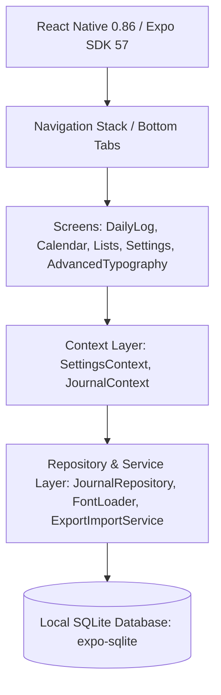

<div align="center">

# 📓 Punteo

**A Minimalist, Local-First Bullet Journal & Productivity Companion**

[](LICENSE)
[](https://expo.dev)
[](https://reactnative.dev)
[](https://www.sqlite.org)
[](#building-production-binaries)
[](package.json)

*Punteo is a high-performance, visually refined Bullet Journal app engineered for speed, aesthetic delight, and total data privacy. Built around Ryder Carroll's Bullet Journal® methodology, it combines rapid logging with zero-cloud local storage, curated themes, and an advanced typography engine.*

[Features](#-key-features) • [Tech Stack](#-architecture--tech-stack) • [Getting Started](#-getting-started) • [Rapid Logging Reference](#-bullet-journal-rapid-logging-system) • [License](#-license)

</div>

---

## 🌟 Key Features

### ⚡ Instant Launch & Local-First Privacy
- **Zero-Cloud & 100% Offline**: Your thoughts, tasks, and journals stay exclusively on your device in a local SQLite database.
- **Zero Telemetry**: No user tracking, no analytics SDKs, no external network dependencies.
- **Instantaneous Startup**: Optimized lazy-asset loader with zero splash latency so you can log your thoughts in milliseconds.

### 📓 Pure Bullet Journal Rapid Logging
- **Standard Syntax Support**:
  - **Tasks** (`•`): Action items to complete.
  - **Notes** (`-`): Thoughts, observations, and facts.
  - **Events** (`◦`): Scheduled occurrences and milestones.
- **State Migration & Lifecycle**: Mark entries as Completed (`✕`), Migrated (`>`), Scheduled (`<`), or Cancelled (`—`).
- **Priority & Categorization**: Flag urgent items (`!!` High, `!` Medium) and add tag filters (`#work`, `#personal`, `#health`).
- **Subtasks & Nesting**: Break down tasks into structured sub-items.

### 📚 Collections & Smart Custom Lists
- **Unlimited Custom Collections**: Group entries into dedicated notebooks (e.g., *Projects, Reading List, Habit Tracker, Wishlist*).
- **Custom Visual Identifiers**: Choose color palettes and vector icons per collection.
- **Metrics & Progress Tracking**: Real-time progress bars showing completion rates for lists.

### 📅 Visual Calendar & Future Log
- **Month & Day Overview**: Seamless monthly calendar grid with dot indicators highlighting dates with active logs.
- **Date Jump**: Instant navigation between past logs, today, and future dates.
- **Scheduled Entry Sync**: Automatically maps scheduled items (`<`) to their target dates.

### 🎨 Curated Aesthetic Themes
- **Designed for Focus**: Includes hand-crafted aesthetic themes suited for daytime, night, and paper enthusiasts:
  - *Warm Moleskine Paper* (Classic notebook vibe)
  - *Slate & Gold* (Dark luxury)
  - *Minimalist Light & Dark* (Clean monochrome)
  - *Nordic Frost, Botanical Sage, Espresso, Cyberpunk Neon*, and more.
- **Dynamic Font Syncing**: Automatically pairs recommended typography with selected aesthetic themes.

### 🔤 Advanced Typography & Live Previews
- **Granular Control**: Customize fonts per hierarchy level (Title H1, Subtitle H2, Calendar H3, Body, Captions, Micro-badges).
- **Live Previews**: Font selection modal renders interactive sample text (*"El veloz murciélago hindú — 123"*) using 25+ embedded Google Fonts (*Inter, Lora, JetBrains Mono, E.B. Garamond, Caveat, Pacifico, Playfair Display, Poppins, Montserrat*, etc.).
- **Typography Controls**: Adjust font weights, pixel sizes, and custom RGB/HEX colors.

### 🔒 Privacy & Security Lock
- **PIN Lock Screen**: Secure your journal with a SHA-256 hashed 4-digit PIN code.
- **Automatic Auto-Lock**: Protects app visibility whenever switched to the background.

### 📦 Complete Data Ownership & Interoperability
- **Markdown Export (`.md`)**: Export your entries formatted into clean GFM Markdown documents organized by date and collection.
- **Full JSON Backup & Restore (`.json`)**: Seamlessly backup and restore your complete database.
- **Factory Reset**: One-click local data wipe utility.

### 🌐 Bilingual Interface
- Fully localized in **English** and **Spanish** with instant runtime language switching.

---

## 🛠 Architecture & Tech Stack



| Layer | Technologies Used |
| :--- | :--- |
| **Framework** | [React Native v0.86.3](https://reactnative.dev) + [Expo SDK 57](https://expo.dev) |
| **Language** | Modern JavaScript (ES6+ / React 19) |
| **Database** | [expo-sqlite](https://docs.expo.dev/versions/latest/sdk/sqlite/) (Native SQLite Engine) |
| **Navigation** | `@react-navigation/native-stack`, `@react-navigation/bottom-tabs` |
| **UI Components** | `@expo/vector-icons`, `@react-native-community/slider`, `@react-native-community/datetimepicker` |
| **Typography Engine** | Custom On-Demand Lazy Font Loader (`FontLoader.js`) with `@expo-google-fonts` |
| **Testing** | [Jest](https://jestjs.io/) + `@testing-library/react-native` |

---

## 📁 Project Layout

```text
Punteo/
├── App.js                      # Application Root & Providers
├── app.json                    # Expo & Build Configurations
├── package.json                # Project Dependencies & Scripts
├── assets/                     # Splash screens, app icons & static media
└── src/
    ├── components/             # Reusable UI components (Typography, Modals, Cards)
    ├── constants/              # Theme definitions, font registries, presets
    ├── context/                # React Contexts (SettingsContext, JournalContext)
    ├── database/               # SQLite initialization, schema migrations, low-level queries
    ├── repositories/           # Data access objects (JournalRepository, ListRepository)
    ├── screens/                # App screens
    │   ├── DailyLogScreen.js         # Daily Log & Rapid Logging view
    │   ├── CalendarScreen.js         # Monthly Calendar & Future Log
    │   ├── ListsScreen.js            # Custom Collections & Lists manager
    │   ├── ListDetailScreen.js       # Collection detail & sub-items view
    │   ├── SettingsScreen.js         # Main settings & theme selector
    │   └── AdvancedTypographyScreen.js # Granular typography controls
    ├── services/               # FontLoader, ExportImportService
    └── utils/                  # Date helpers, string formatters, validators
```

---

## 📖 Bullet Journal Rapid Logging System

Punteo adheres strictly to the classic Bullet Journal rapid logging notation:

| Symbol | Type | Description |
| :---: | :--- | :--- |
| `•` | **Task** | An actionable item. Tap to toggle completion. |
| `✕` | **Completed** | Task that has been executed. |
| `>` | **Migrated** | Task moved forward to another daily log or collection. |
| `<` | **Scheduled** | Task assigned to a specific future date on the calendar. |
| `—` | **Cancelled** | Task no longer relevant or required. |
| `-` | **Note** | Facts, thoughts, or information you want to remember. |
| `◦` | **Event** | Time-bound occurrences, meetings, or milestones. |
| `!!` | **Priority** | High priority mark highlighting critical entries. |

---

## 🚀 Getting Started

### Prerequisites

Make sure you have the following installed on your machine:
- **Node.js**: `v18.x` or `v20.x` (LTS recommended)
- **npm** or **yarn**
- **Expo Go** app on your device (for rapid testing) OR **Android Studio / Xcode** for native emulation.
- **JDK 17** (required if compiling local Android builds with EAS).

### 1. Clone & Install Dependencies

```bash
# Clone the repository
git clone https://github.com/your-username/punteo.git
cd punteo

# Install node packages
npm install
```

### 2. Start Development Server

```bash
# Run Expo Metro Bundler
npm start

# Or directly launch Android emulator
npm run android
```

Scan the QR code printed in the terminal using the **Expo Go** application on your device.

### 3. Run Test Suite

```bash
# Execute Jest unit & integration tests
npm test

# Run tests with coverage report
npm run test:coverage
```

---

## 📦 Building Production Binaries

Punteo is configured for local standalone builds using [EAS CLI](https://docs.expo.dev/eas/).

### Local Android APK Build

To generate an standalone offline `.apk` binary locally without cloud queues:

```bash
# Ensure JAVA_HOME points to JDK 17
JAVA_HOME=/opt/homebrew/opt/openjdk@17 eas build --platform android --profile preview --local
```

The output build binary will be generated under `punteoapp.apk` in the root project folder.

---

## 🔒 Security & Data Privacy

Punteo takes data privacy seriously:
- **Zero Cloud Storage**: All SQLite data is stored locally in device app sandbox directory.
- **No Third-Party Analytics**: We do not include Firebase, Mixpanel, Amplitude, or any tracking SDKs.
- **Offline First**: The app requires zero network permissions to function.

---

## 📄 License

Distributed under the **MIT License**. See [`LICENSE`](LICENSE) for more details.

---

<div align="center">
  Crafted with ❤️ for bullet journaling purists and minimalism lovers.
</div>
